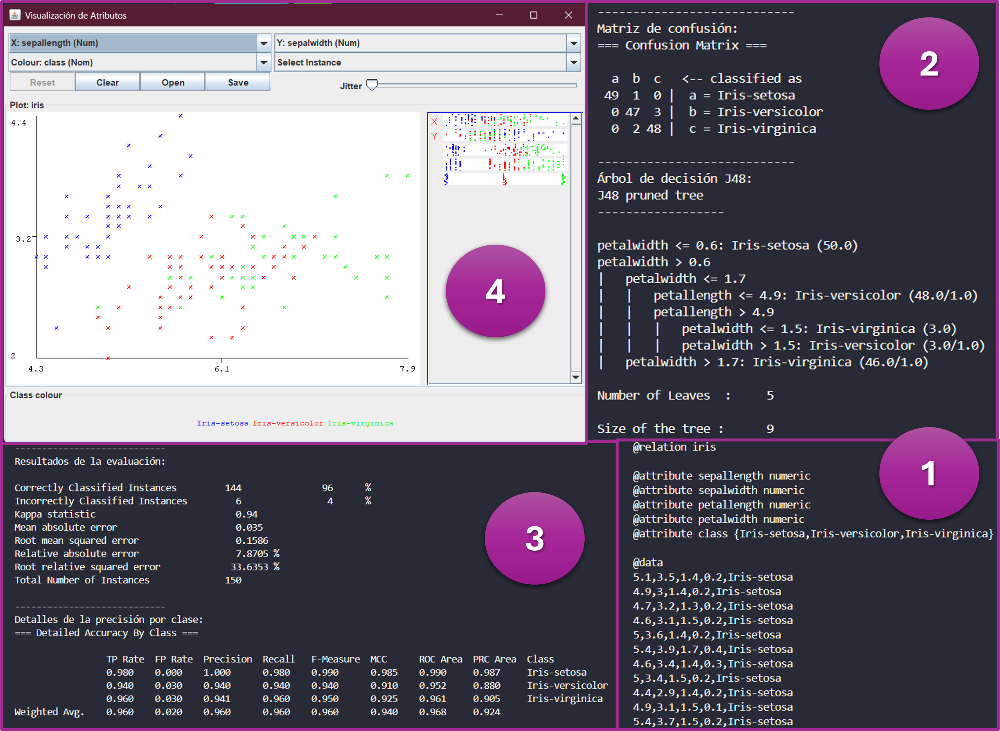

# Probando WEKA en VSC




## 1. Descripción del proyecto
Este repositorio muestra las principales funcionalidades de WEKA ejecutadas desde el editor Visual Studio Code y mediante la API de WEKA. La finalidad de esta prueba es demostrar que se puede hacer uso de esta API desde el mencionado editor.

## 2. Estado del proyecto


## 3. Tecnologías utilizadas


## 4. Guía de instalación
1. Agregar las extensiones: ```Language Support for Java (TM) by Red Hat``` y ```Extension Pack for Java``` a su IDE de preferencia.

2. Clonar el repositorio en su IDE:
    ```
    https://github.com/caroSeminario23/Probando_WEKA.git
    ```

3. Descargar las siguientes librerías *(en sus últimas versiones)*:
    - weka
    - jcommon
    - jfreechart

4. Crear una carpeta llamada ```lib``` y almacenar esas 3 librerías.

5. Crear una carpeta llamada ```.vscode``` y crear 2 archivos:
    - **launch.json** *(generalmente su contenido se configura automáticamente y presenta la siguiente estructura)*
        ```
        {
            "version": "0.2.0",
            "configurations": [
                {
                    "type": "java",
                    "name": "Main",
                    "request": "launch",
                    "mainClass": "Main",
                    "projectName": "Lab_WEKA_1ddf98b6",
                    "vmArgs": "--add-opens java.base/java.lang=ALL-UNNAMED"
                }
            ]
        }
        ```

    - **settings.json**
        ```
        {
            "java.project.referencedLibraries": [
                "lib/weka-396.jar",
                "lib/jcommon-1024.jar",
                "lib/jfreechart-156.jar"
            ]
        }
        ```

6. Guardar los cambios y reiniciar el editor.

## 5. Licencia
[](./LICENSE)